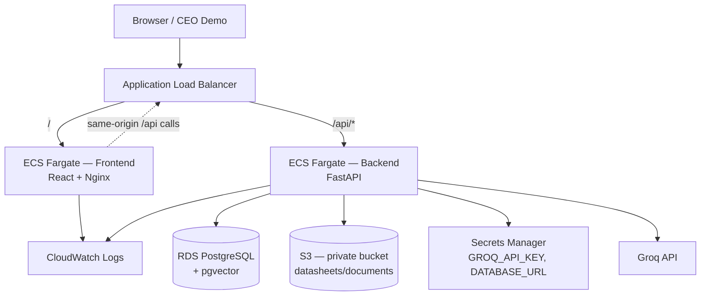

# Architecture

## AWS MVP Deployment Architecture

This diagram describes the **Phase 10 minimum AWS deployment** used for the CEO demo. It is intentionally small, single-region, and not highly available.



### Routing

| Path | Target |
|------|--------|
| `/` | Frontend (Nginx SPA) |
| `/api/*` | Backend (FastAPI) |
| `/health` (backend target group) | Backend liveness |
| `/health` (frontend target group) | Nginx liveness |

The frontend build uses an empty `VITE_API_BASE_URL` so the browser calls `/api/v1/...` on the same ALB hostname.

### AWS services used

| Service | Purpose |
|---------|---------|
| ECR | Store backend and frontend container images |
| ECS Fargate | Run one backend task and one frontend task |
| Application Load Balancer | Single public URL for the CEO demo |
| RDS PostgreSQL | Application database with pgvector |
| S3 | Private document/datasheet storage |
| Secrets Manager | Groq API key, database URL, S3 credentials |
| CloudWatch Logs | ECS container logs |

### Not in MVP scope

- EKS / Kubernetes
- CloudFront / Route 53
- Multi-AZ RDS
- Autoscaling
- CI/CD pipelines
- Terraform / CloudFormation (templates provided as JSON examples only)

## Application architecture (logical)

For the full product architecture and responsibility boundaries, see [target-architecture.md](target-architecture.md).

```text
RFQ text
  → Groq extraction (language only)
  → deterministic validation (PASS/FAIL/UNKNOWN)
  → evidence retrieval (embeddings + pgvector)
  → deterministic recommendation (PASS-only)
  → human sales product selection
  → deterministic quotation calculation
  → simulated customer email
  → sales follow-up queue
```

**Groq does not override engineering validation.** Recommendation and quotation gates remain deterministic.
